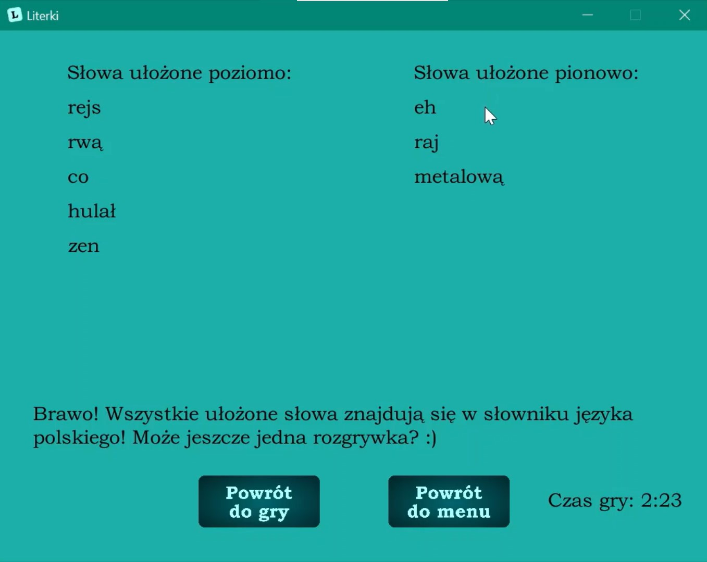

# Literki - Letters Game
Serious game for training Polish word formation skills created with Java and LibGDX game development framework as a university project.

## Table of Contents
* [Purpose of the project](#purpose-of-the-project)
* [Technologies](#technologies)
* [Game rules](#game-rules)
* [How the game works](#how-the-game-works)

## Purpose of the project
Game created to help training word formation skills of children and everyone who likes scrabble word games in Polish. 

## Technologies
The project is created with:
* Java 7
* LibGDX 1.10.0

## Game rules
The purpose of the game is to arrange the drawn letters (21 at the beginning) into a crossword built from words included in a Polish dictionary. Player can swap any mismatched letter, but instead they receive 3 new letters from a letter bank. Every letter must be in a crossword to finish the game and if any of created words doesn't exist, the player is informed about it and allowed to go back to game and do a correction.

## How the game works
#### [Game presentation on YT](https://youtu.be/Kkjz5K5syYM)

### Main menu:

### During game:

### End of the game - there is a non-existing word:
When there is a word that doesn't exist, the text at the bottom will encourage the player to correct it - wrong word will be displayed in red.

### End of the game - the whole crossword is correct:
When the crossword is correct, the text at the bottom will congratulate and suggest to try a new game.

